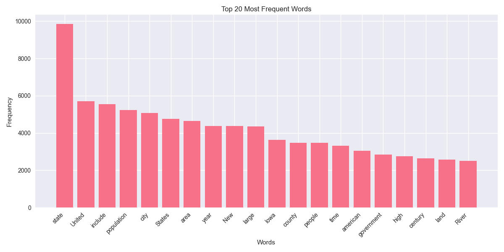
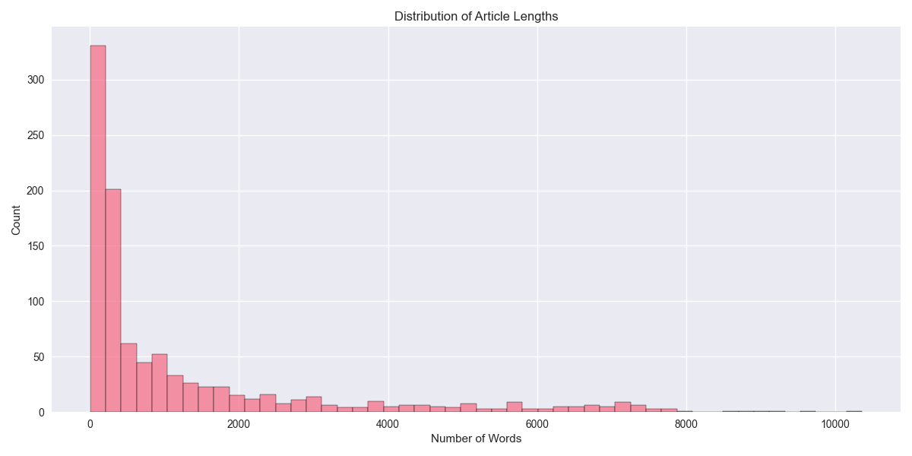
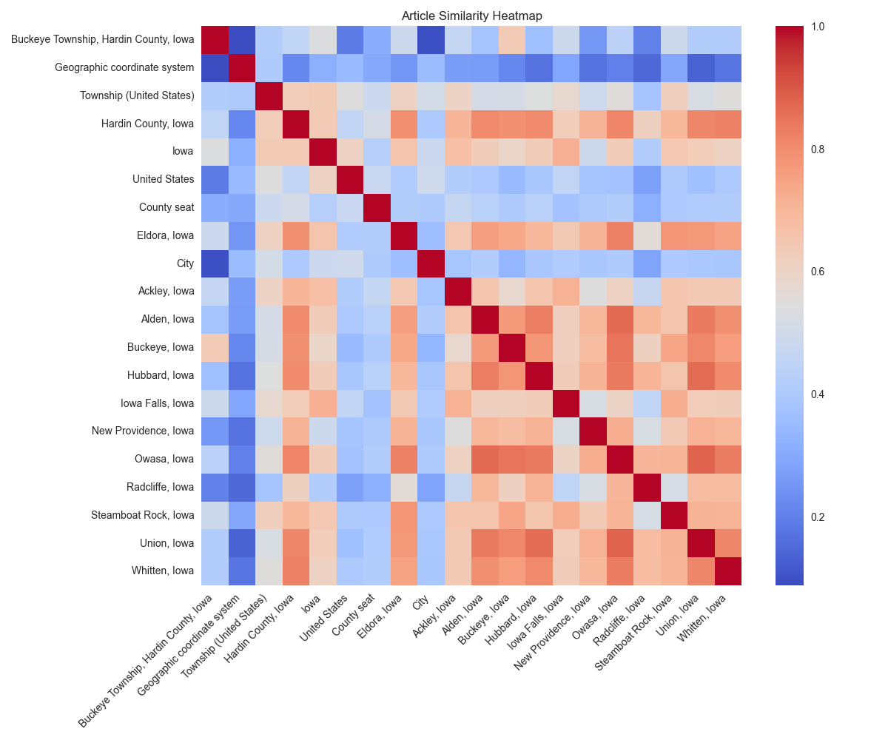
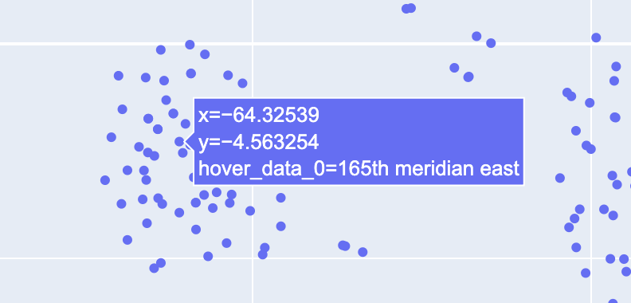
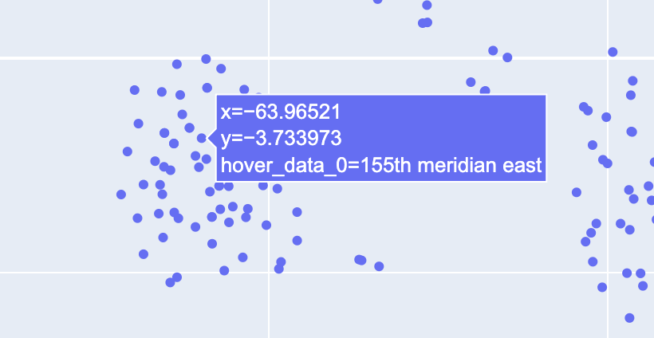
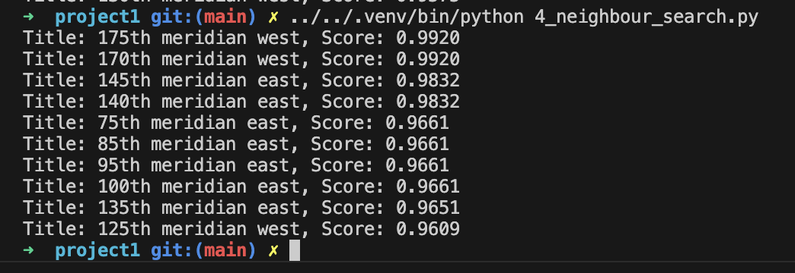
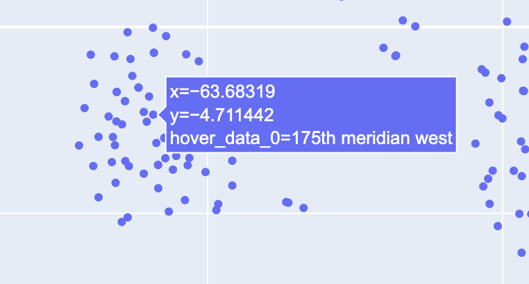

# Article Recommendation System: Technical Report

Authors:
- Mateusz Idziejczak 155842
- Mateusz Stawicki 155900

## 1. Introduction

This report presents a comprehensive article recommendation system that leverages modern natural language processing techniques to suggest related Wikipedia articles based on content similarity. The system implements a complete pipeline from data collection to recommendation generation.

### 1.1 Objectives
- Create a scalable web scraping system for Wikipedia articles
- Implement efficient text preprocessing and vectorization
- Develop a fast and accurate recommendation engine
- Provide meaningful article suggestions based on content similarity

## 2. System Architecture

The system is implemented in four main components:

1. Data Collection (`1_scraping.py`)
2. Text Preprocessing (`2_preprocessing.py`)
3. Embedding Generation (`3_embeddings.py`)
4. Similarity Search (`4_neighbour_search.py`)

## 3. Implementation Details

### 3.1 Data Collection
The data collection component uses:
- `BeautifulSoup4` for HTML parsing
- `requests` for web scraping
- Random article selection as entry points
- Breadth-first crawling strategy

Key features:
- Automatic handling of Wikipedia's link structure
- Filtering of non-article pages
- Robust error handling for failed requests
- Collection of both titles and article content

### 3.2 Text Preprocessing
Text preprocessing utilizes:
- `spaCy` for advanced NLP tasks
- Lemmatization for word normalization
- Stop word removal
- Alpha-only token filtering

The preprocessing pipeline ensures:
- Consistent text representation
- Removal of irrelevant linguistic elements
- Reduced dimensionality of the final dataset

### 3.3 Embedding Generation
The embedding system employs:
- Sentence-BERT (`all-MiniLM-L6-v2` model)
- Dense vector representations (384 dimensions)
- Batch processing for efficiency

Benefits:
- High-quality semantic representations
- Efficient computation
- Good balance between accuracy and performance

### 3.4 Similarity Search
The recommendation engine features:
- FAISS for efficient similarity search
- L2 distance metric
- Support for multiple query articles
- Score normalization

Capabilities:
- Fast nearest neighbor search
- Handling of multiple input articles
- Exclusion of query articles from results
- Configurable number of recommendations

## 4. Technical Specifications

### 4.1 Dependencies
- Python 3.x
- BeautifulSoup4 for web scraping
- spaCy with English model
- sentence-transformers
- FAISS for similarity search
- pandas for data management
- NumPy for numerical operations

### 4.2 Performance Characteristics
- Embedding dimension: 384
- Similarity metric: L2 distance
- Search complexity: O(n) with FAISS
- Support for batch processing

## 5. Data Analysis and Visualizations

### 5.1 Word Frequency Analysis
The following visualization shows the 20 most frequent words in our article collection:

This distribution helps us understand the most common topics and terms across our article dataset.

### 5.2 Word Cloud Visualization
The word cloud provides a visual representation of term frequencies, where larger words appear more frequently in the articles:

### 5.3 Article Length Distribution
The following histogram shows the distribution of article lengths in our dataset:

This distribution helps us understand the variety in article sizes and identify any potential outliers in our dataset.

### 5.4 Article Similarity Analysis
The heatmap below shows the similarity scores between the first 20 articles in our dataset:

Brighter colors indicate higher similarity between articles, while darker colors indicate lower similarity. This visualization helps us understand how articles are related to each other based on their content. "..., Iowa" articles are close to each other in the heatmap.

### 5.5 Article Embedding Space
An interactive visualization of article embeddings reduced to 2D using t-SNE can be found in `visualizations/embedding_visualization.html`. This visualization allows us to explore how articles are distributed in the embedding space and identify potential clusters of related content. meridian west and east articles in bottom left corner are close to each other.

## 6. Conclusion

The implemented system demonstrates an effective approach to content-based article recommendations, combining modern NLP techniques with efficient similarity search. The modular architecture allows for easy maintenance and future improvements.

For input:

Result:

## Usage Instructions

1. Run the `1_scraping.py` script to collect Wikipedia articles. (already done)
2. Run the `2_preprocessing.py` script to preprocess the collected articles. (already done)
3. Run the `3_embeddings.py` script to generate article embeddings. (already done)
4. Run the `4_neighbour_search.py` script to generate article recommendations.
    1. Modify the `query_titles` variable to specify the titles of the articles you want to find similar articles for.
    2. The function will return a list of recommended articles, along with their similarity scores.
    3. The titles can be found in the `preprocessed_articles.csv` file.

## References

1. Sentence-BERT: https://www.sbert.net/
2. FAISS: https://github.com/facebookresearch/faiss
3. spaCy: https://spacy.io/
4. Wikipedia API Documentation: https://www.mediawiki.org/wiki/API:Main_page
